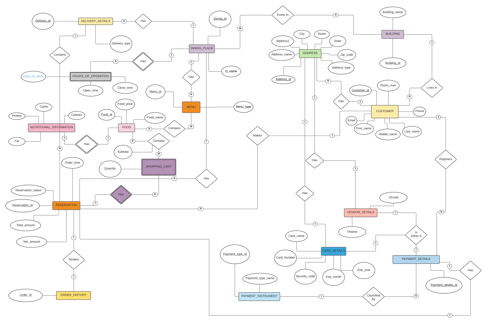
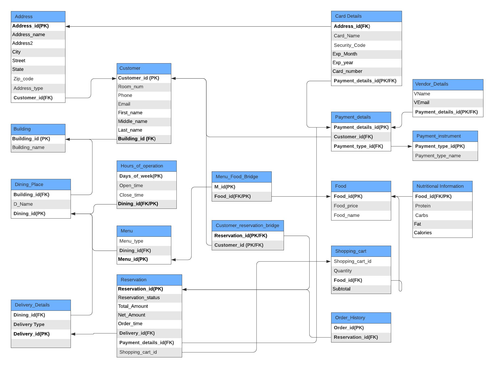
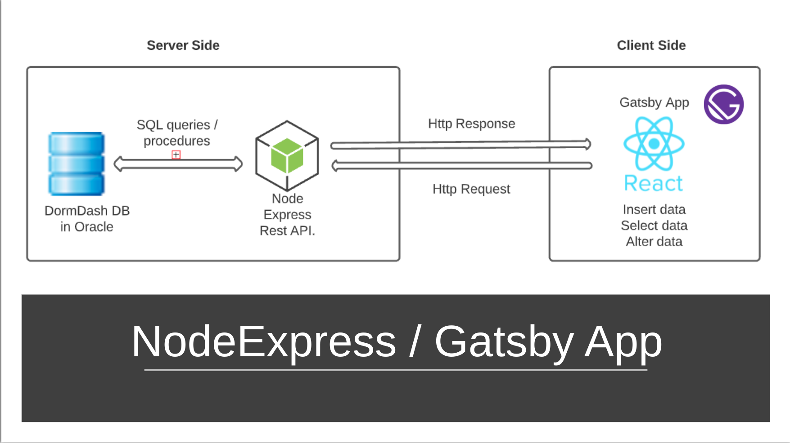
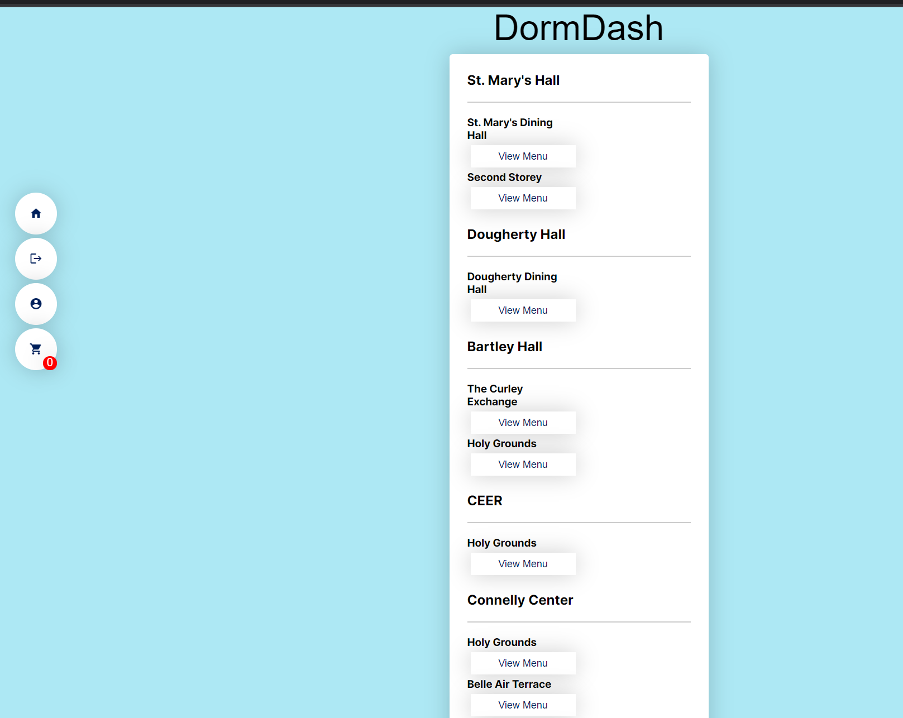

Fall 2021 Databases Systems project - Dormdash

An on-demand online food ordering and delivery system that lets you order food from dining places in your university

# Entity Relationship Diagram

# Relational Schema

# Dormdash Application Technologies

# Dormdash Application UI

